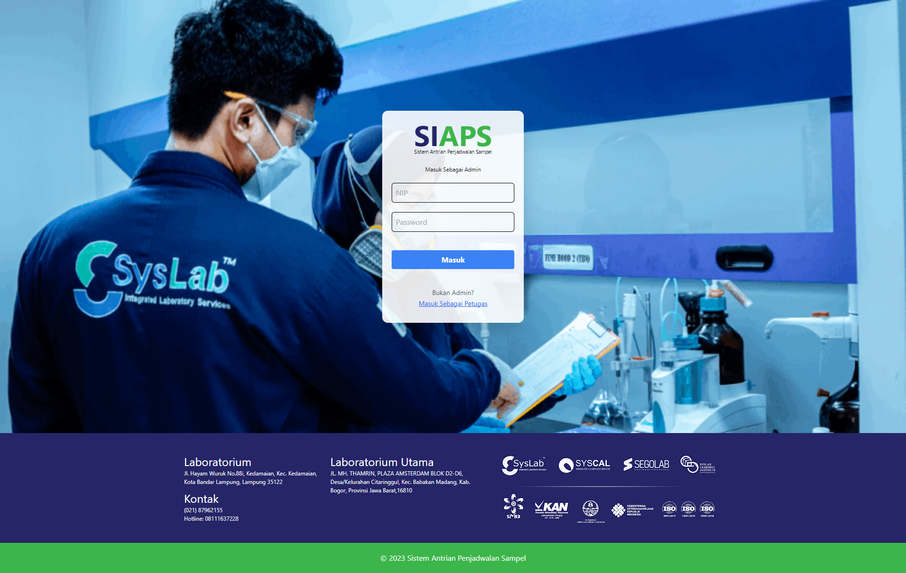
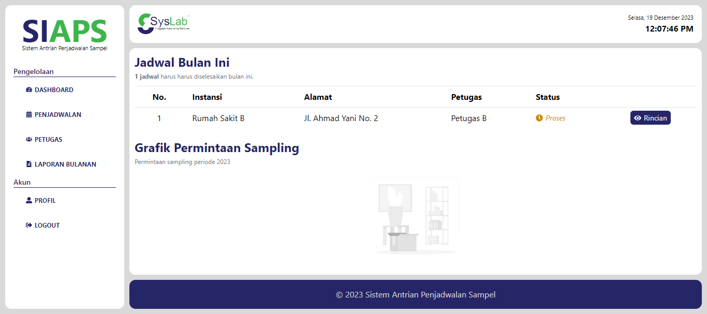
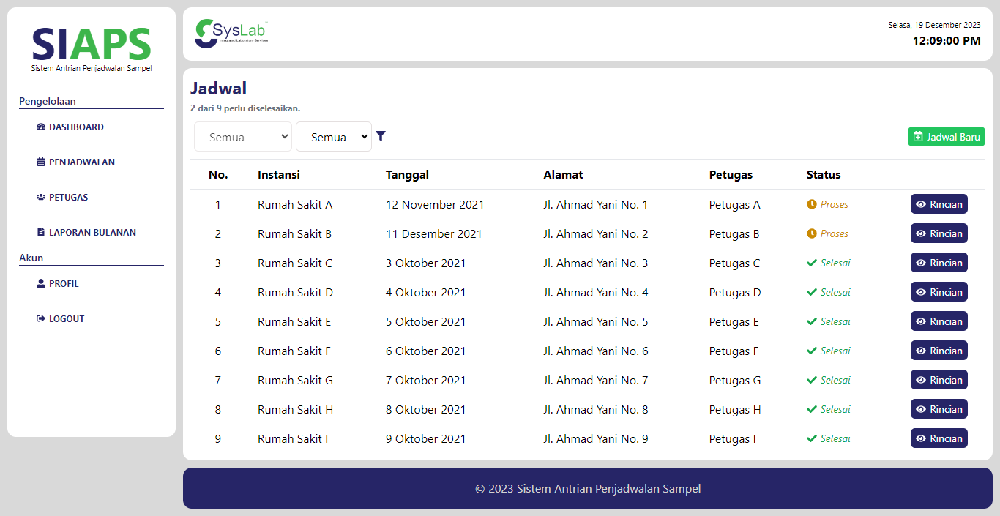
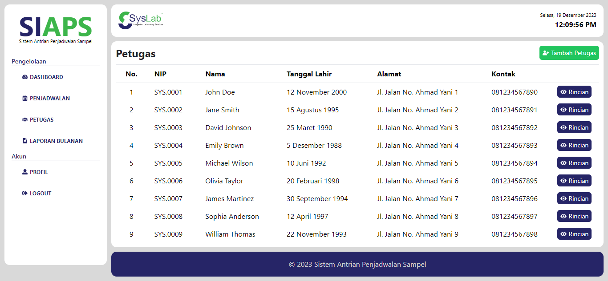

# UAS Pemrograman WEB Lanjut 2023 Frontend

Repositori ini berisi kode program untuk tampilan dari aplikasi web Sistem Antrian Pengambilan Sampel. Aplikasi ini bertujuan untuk mempermudah proses pengelolaan jadwal, petugas, laporan bulanan, dan lainya.

### Tech Stack

- [Javascript](https://www.javascript.com/)
- [TailwindCSS](https://tailwindcss.com/)
- [ReactJS](https://reactjs.org/)
- [vite](https://vitejs.dev/)

### Instalasi

Sebelum melanjutkan tahap ini, pastikan anda sudah menginstall [NodeJS](https://nodejs.org/en/) dan [Git](https://git-scm.com/).

> Clone repositori ini dengan cara mengetikkan perintah berikut pada terminal:
>
> ```
> git clone https://github.com/henhen02/UAS-PWL-Frontend.git
> ```
>
> Masuk ke direktori repositori yang telah di clone dengan cara mengetikkan perintah berikut pada terminal:
>
> ```
> cd UAS-PWL-Frontend
> ```
>
> Install dependencies dengan cara mengetikkan perintah berikut pada terminal:
>
> ```
> npm i
> ```
>
> or
>
> ```
> pnpm install
> ```
>
> Jalankan aplikasi dengan cara mengetikkan perintah berikut pada terminal:
>
> ```
> npm run dev
> ```
>
> or
>
> ```
> pnpm run dev
> ```

Aplikasi ini dapat berjalan dengan program backend yang dapat dilihat pada tautan [ini](https://github.com/henhen02/UAS-PWL-Backend.git)

### Struktur Direktori

```
UAS_PWL_Frontend
├─ assets
├─ public
└─ src
   ├─ assets
   ├─ components
   │  ├─ buttons
   │  ├─ cards
   │  ├─ layouts
   │  └─ user-layouts
   ├─ pages
   │  ├─ admin
   │  │  ├─ penjadwalan
   │  │  ├─ petugas
   │  └─ petugas
   ├─ root
   └─ static

```

### Preview

##### Login Page



##### Dashboard Admin



##### Penjadwalan



##### Petugas



### Author

Hendri Aldi Zulfan

- [henhen02](github.com/henhen02)
- [hendrialdizulfan@gmail.com](mailto:hendrialdizulfan@gmail.com)
